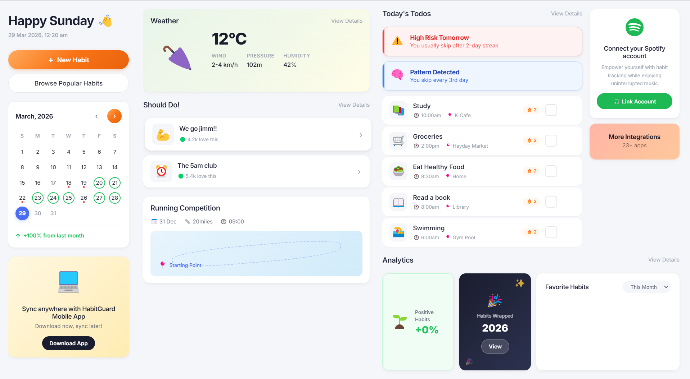
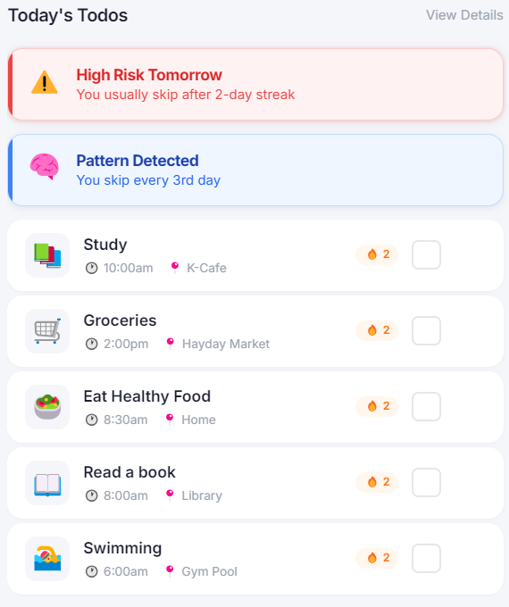
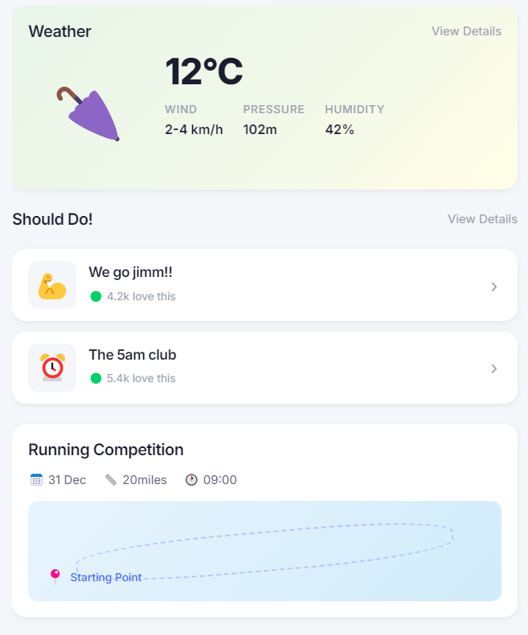
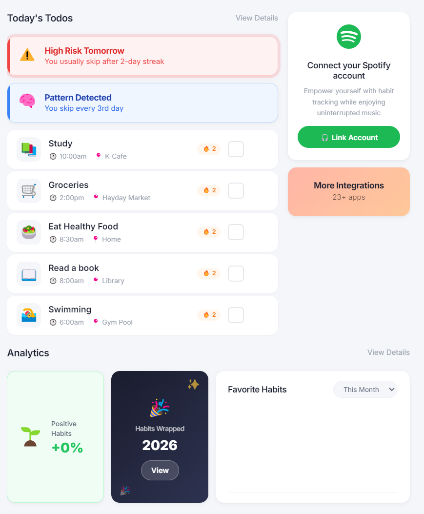
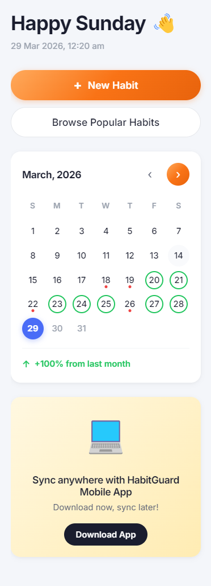

<div align="center">
  <h1>🛡️ HabitGuard</h1>
  <h3>Predictive Habit Intelligence Dashboard</h3>
  <p><em>«Most habit apps tell you when you fail — HabitGuard tells you before you fail.»</em></p>
</div>

---

## 🎯 Problem

Traditional habit trackers are reactive:
- They show streaks
- They show history
- But they do NOT prevent failure

Users often repeat the same pattern:
> *"I always break my streak after 2–3 days"*

---

## 💡 Solution

HabitGuard introduces a predictive system that:
- Analyzes recent habit history (last 7–14 days)
- Detects repeating failure patterns
- Warns the user BEFORE the expected failure point

**Example:**
You usually skip every 3rd day → **⚠️ High Risk Tomorrow**

---

## 🚀 Features

### 🔴 Habit Tracking
- Add, delete, and manage habits
- Mark completion with daily tracking
- Streak tracking per habit

### 🧠 Pattern Detection (Core Logic)
- Detects repeated gaps in habit completion
- Identifies patterns like:
  - *"Skip every 3rd day"*
  - *"Break after 2-day streak"*

### ⚠️ Failure Prediction (USP)
- Predicts upcoming risk based on behavior
- Displays: **High / Medium / Low** risk levels
- Updates instantly after each action

### 📊 Dashboard UI
- 3-column layout (Context, Activity, Insights)
- Card-based modern design
- Clean and minimal interaction flow

### 💾 Local-First Storage
- No backend, no cloud
- Uses localStorage / JSON
- Fully offline

### 🔄 Import / Export
- Backup data as JSON
- Restore on any device

---

## 📸 Screenshots

<div align="center">
  <!-- Full Size Dashboard Image -->
  
  <p><em>HabitGuard Full Dashboard Layout</em></p>
</div>

<br>

<div align="center">
  <!-- Side-by-side images -->
  
  
</div>

<br>

<div align="center">
  <!-- Side-by-side images -->
  
  
</div>

> **Note:** Please create a folder named `screenshots` in your repository and save your chat images there as `dashboard.png`, `todos.png`, etc. to display them properly here.

---

## ⚙️ Tech Stack

- **Electron.js** → Desktop application framework
- **HTML / CSS / JavaScript** → UI + logic
- **LocalStorage / JSON** → Data persistence

---

## ⚠️ Limitations

- No real-time sync across devices
- No authentication system
- Prediction is heuristic-based (not machine learning)

---

## 🖥️ Installation

```bash
git clone https://github.com/yourusername/HabitGuard.git
cd HabitGuard
npm install
npm start
```

## 📦 Build

To build the executable for your OS:
```bash
npm run build
```

---

## 🧠 Key Insight

> *"This project focuses on behavioral pattern awareness, not just tracking."*

It demonstrates:
- UI/UX design thinking
- Pattern-based logic
- Local-first system architecture

---

## 👨‍💻 Author

**Sachin Saroj**
